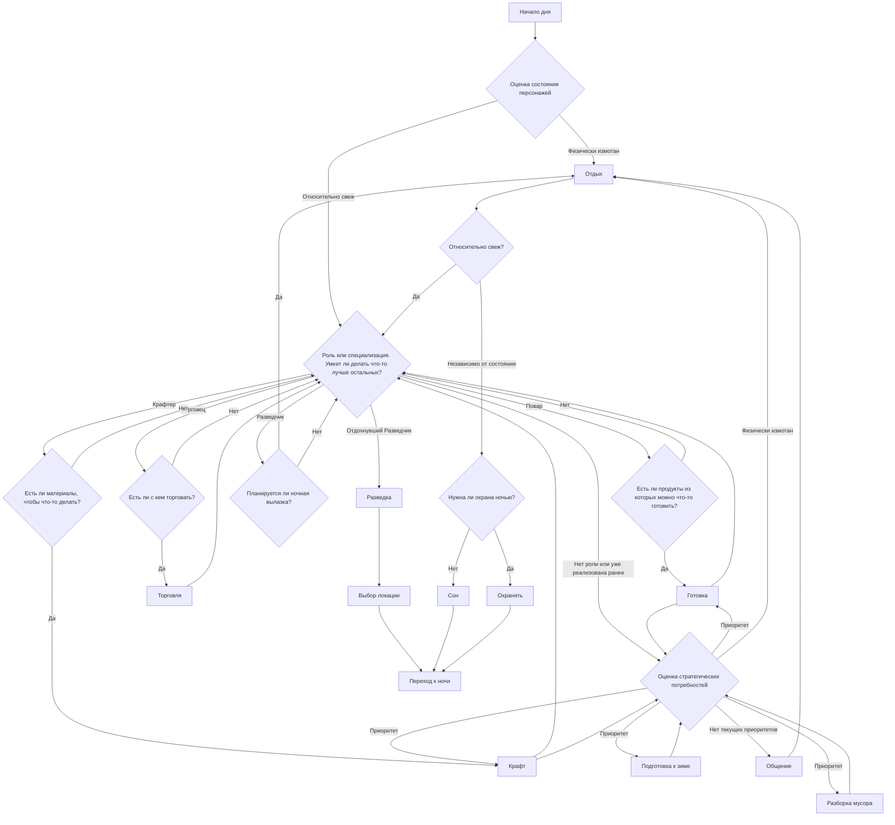
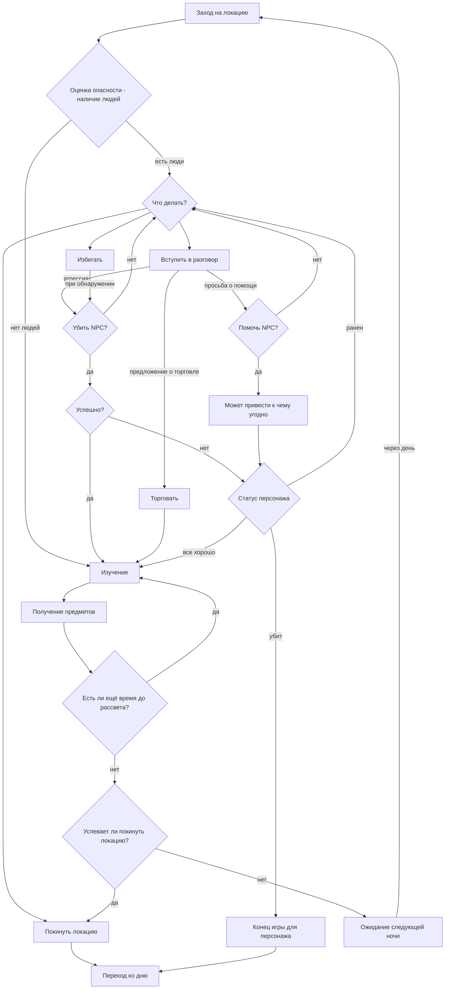

## This war of mine

Нелинейный стратегичеcкий survival с условно-открытым миром о выживании обычных людей, спрятавшихся в полуразрушенном доме в условиях 
осаждённого города и подступающей зимы.

### Основные механики

- Заказнчивающиеся припасы (еда, детали, медикаменты), вынуждающие игрока выискивать их.
- Низкая температура, заставляющая добывать дрова из подручных средств.
- Угрозы извне, вынуждающие искать средства защиты.
- Случайные непредсказуемые события, требующие от игрока каких-либо действий, влияющих на мораль и самочувствие всей команды.

### Основной игровой процесс

Игра разделяется на две фазы: день и ночь. В каждой фазе у игрока свои задачи. Днём крафт предметов, готовка еды, подготовка дома к 
холодам, отдых, иногда взаимодействие с приходящими NPC, взаимодействие членов команды между собой (лечение, разговоры etc).  Каждый 
персонаж под управлением игрока имеет определённые сильные и слабые стороны - кто-то умеет хорошо готовить, кто-то моет переносить больше вещей,
кто-то склонен к истерике или алкоголизму. Задача игрока максимально правильно распределять задания между персонажами.
Ночью игрок может (но не должен) отправиться в разведку в одну из нескольких локаций. Цель разведки: получение добычи, коей является практически всё, 
что угодно: еда, детали, доски, алкоголь, оружие, патроны  etc. В силу ограниченности инвентаря игрок должен постоянно принимать решение о
целесообразности включения каждого предмета в инвентарь.

### Действия в игре

| Все действия вперемешку | По важности | По очерёдности |
| --- | --- | --- |
| Разведка по ночам | Разведка по ночам   **Core** - эта механика - основной способ добычи ресурсов в игре | Разборка мусора в доме |
| Крафт предметов | Крафт предметов   **Core** - эта механика позволяет из преобразовывать ресурсы в необходимые вещи, без которых выживание не является возможным| Общение с членами команды|
| Общение с членами команды | Отдых или работа   **Core** - требует от игрока правильно распределять задачи между персонажами, к примеру глупо заставлять разведчика делать домашние дела после бессонной ночи | Разведка |
| Отдых или работа | Подготовка дома к холодам   **Core** - позволит максимально безболезненно пережить холода, в противном случае есть шанс вообще никому ничего не пережить | Отдых или работа |
| Готовка еды | Торговля   **Core** - помогает получить редкие, но необходимые ресурсы | Готовка еды |
| Торговля | Помогать или не помогать NPC   **Meta** - предлагает игроку сделать зачастую непростой моральный выбор - помочь или отказать просящему | Убивать или не убивать  NPC | 
| Помогать или не помогать NPC | Разборка мусора в доме   **Meta** - позволяет получать дополнительные ресурсы без ночных вылазок | Помогать или не помогать NPC |
| Убивать или не убивать NPC | Общение с членами команды   **Meta** - двигает сюжет, позволяет понять сильные и слабые стороны персонажей | Потакание слабостям | 
| Разборка мусора в доме | Убивать или не убивать NPC   **Meta** - требует от игрока сделать трудный моральный выбор, который однозначно отразится на настроении команды, но не может быть однозначно расценён как "хороший" или "плохой" | Подготовка дома к холодам |
| Подготовка дома к холодам | Готовка еды   **Meta** - несмотря на кажущуюся важность этой механики, по факту делать это нужно будет довольно редко, так как большую часть времени все будут жить впроголодь | Крафт предметов |
| Потакание слабостям | Потакание слабостям   **Meta** - выпить или покурить при наличии возмоности | Торговля |      

В качестве очень упрощенных примеров - день игры 

... и ночь - разведчик изучает локацию.

